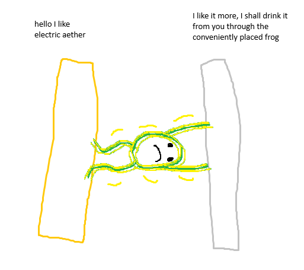

# Waves and particles
Before we continue with electricity, let's trace back a bit and do a detour on the nature of light. Around the same time as electricity was being discovered, there were also some theories regarding the nature of light:
- a "luminiferous aether" made up of subtle particles, in which light travels as a longitudinal wave (like sound) proposed by Christiaan Huygen, and advocated for by Robert Boyle.
- small non-spherical particles called "corpuscules", which had two different sides to explain polarization, as proposed by Newton. The solution while equally not true, had more elegance as it accounted for both polarization which was impossible in longitudinal waves, and for the lack of a drag the "luminiferous aether" would have on planetary bodies if it indeed was all encompassing.

The particle model was proven further likely by James Bradley, who carried out a series of experiments attempting to measure the stellar parallax, which he failed to detect placing a lower limit on the distance to stars. It did lead however to a different observation: the star exhibited apparent motion during the time when earth was at its fastest perpendicular to it, rather than parallel. Bradley explained this discrepancy by likening the ray of light to rain hitting a traveling object at an angle. This proved difficult to be explained by the aether model, since it would force the aether to be stationary in relation to the star, which would force the earth to move through it. Using the angle of the apparent shift and earth velocity, he was able to estimate the speed of light to $301,000\frac{km}{s}$.

# Kites and Frogs
In the late 18th century Benjamin Franklin showed lightning and electricity to be the same phenomena by having his son fly a kite through storm. The kite had a key and a Leyden Jar attached to the string, and further experiments have proved the charge obtained from lightning held the same properties as one from static generators. He later developed lightning rods and established the convention of positive and negative charge, the former being a surplus, the latter a deficiency of the electric aether.
> At this key the phial (Leyden jar) may be charged; and from the electric fire thus obtained spirits may be kindled, and all the other electric experiments be formed which are usually done by the help of a rubbed glass globe or tube, and thereby the sameness of the electric matter with that of lightning be completely demonstrated.

Franz Aepinus further refined and extended the model, by giving magneticism its own fluid which could not flow freely and only acted on particles of iron, and more clearly defined the electric fluid to a state that aside from wording matches up with our current understanding.
>The particles of the electric fluid repel each other, attract and are attracted by the particles of all bodies with a force that decreases in proportion as the distance increases; the electric fluid exists in the pores of bodies; it moves unobstructedly through non-electric (conductors), but moves with difficulty in insulators; the manifestations of electricity are due to the unequal distribution of the fluid in a body, or to the approach of bodies unequally charged with the fluid.

Around 1784, Charles-Augustin de Coulomb devised the torsion balance (a specialised newtonometer) to devise what is now known as Coulomb's Law:
$$
|F|=k\frac{|q_1||q_2|}{r^2}
$$
$|F|$ - the absolute value of the force acting on two charged bodies
$|q_i|$ - the charge of one of the bodies
$r$ - the distance between the bodies
$k$ - a constant

6 years later Luigi Alyisio Galvani noticed the twitching of a frog's muscle hanging from an iron balustrade by a copper hook. He published his findings, believing the muscles to form a sort of natural Leyden jar, which the hook compromised. Alessandro Volta formed another explanation, where the frog acted as a mere conductor between a naturally forming current between the two metals, which he later proved by constructing a prototype galvanic cell just a year before the turn of the century, only to perfect the design a year later.

# TL;DR
Stuff we know:
- Lightning is current
- Electrostatic force follows the inverse square law
- Light is very fast and we know approximately how fast

Stuff we suspect:
- Electricity and magnetism are fluids
- Light is waves or particles, but probably particles

Stuff we have:
- galvanic cells