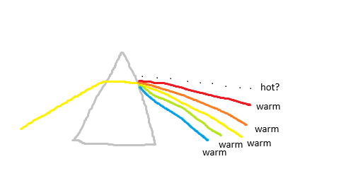
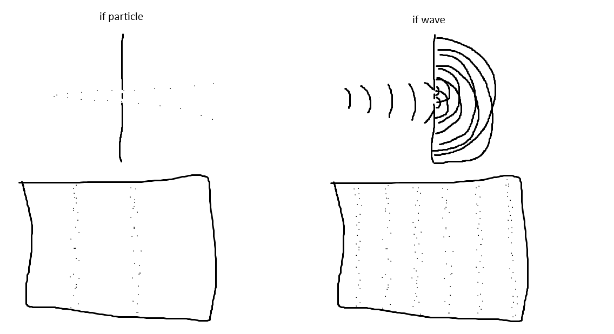
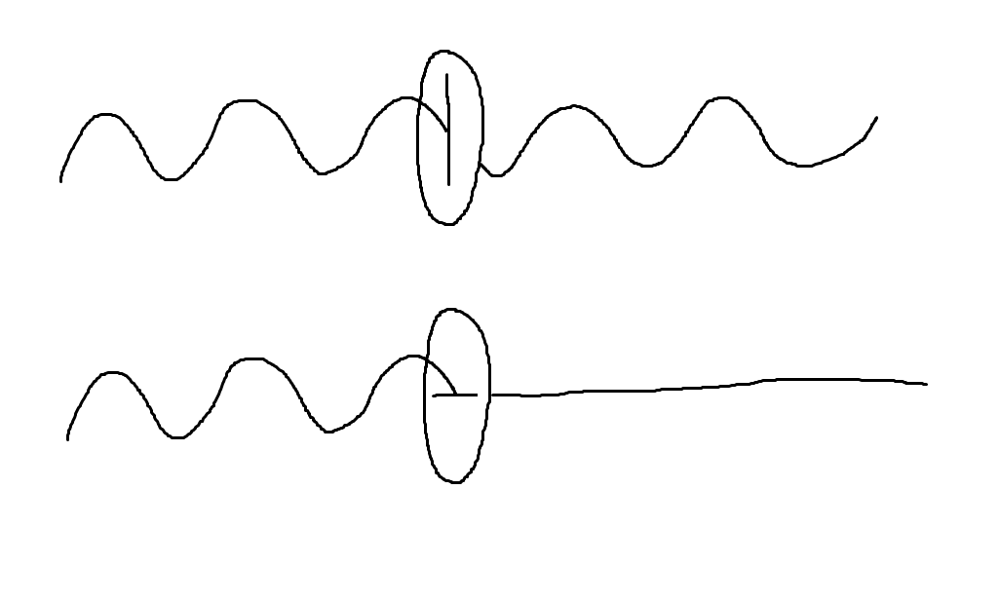
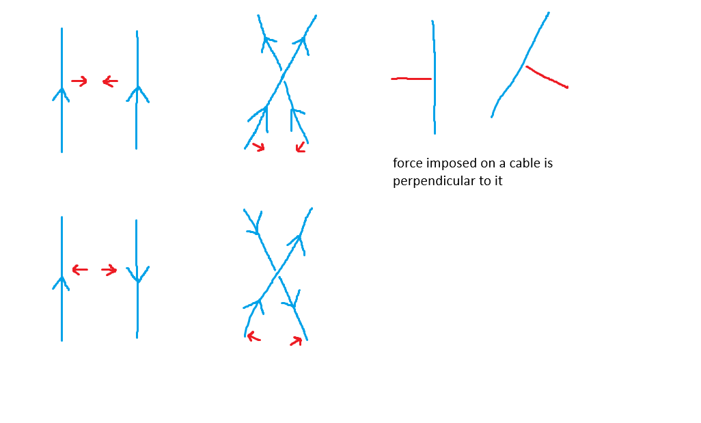
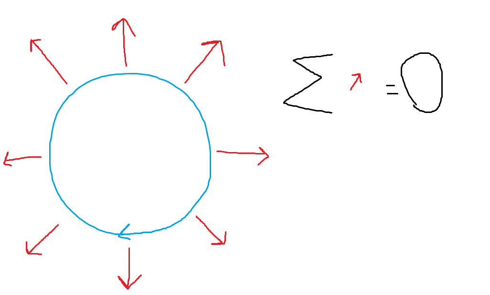
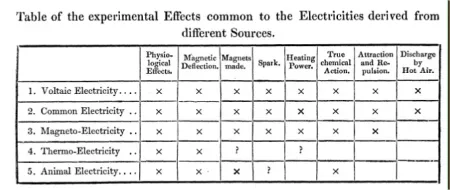

# Beyond the rainbow
Just at the dawn of the 19th century, a new type of light was discovered by William Herschel - "heat rays". The idea for the experiment was simple:
1. Split the light using a prism
2. Place a thermometer at every color
3. Figure out which color makes the sun feel warm

There was however one issue with the results: the control thermometer placed just beyond the red color on which seemingly no light shined turned out to warm up the most.

Just a year later, Johann Wilhelm Ritter observed the color just beyond the violet end of the spectrum to be especially effective at lightening sodium chloride soaked paper, a property for which the name "chemical rays" arose. The same year the wave nature of light was finally proven by Thomas Young in the now famous double-slit experiment.

If light was made up of particles, the light would just show up as two lines. If it was waves however, in case of a single hole, it would propagate in a circular pattern producing alternating rings of positive and negative signals. Add a second hole and you've got a second set, their positive and negative regions either cancelling out or growing in strength, producing a pattern of multiple lines. It was indeed multiple lines.

Around 20 years later, Thomas Young and Augusting-Jean Fresnel proposed the transverse wave model, in which the wave oscillated not in the direction of propagation, but rather perpendicularly to it. This solved the problem of polarization, previously only explained by Newton's corpuscule model.

# Electro... magnetism?
Going back to electricity, in 1806 Sir Humphry Davy using about 250 voltaic cells decomposed potash and soda, discovering the previously unknown potassium and sodium. In 1809 he demonstrated the arc light publicly - a device that produced an arc of electricity across a 100mm (4 inch) gap using a mere 2000 voltaic cells.

The big break happened in 1820 when Hans Christian Ørsted discovered how electric current traveling in a wire deflected the needle of a compass, confirming William Watson's suspicions. Given the clue, André-Marie Ampère arrived to the scene mere months later, only for his work to culminate in an 1827 work announcing the beginning of electrodynamics:

1. Two parallel portions of a circuit attract one another if the currents in them are flowing in the same direction, and repel one another if the currents flow in the opposite direction.
2. Two portions of circuits crossing one another obliquely attract one another if both the currents flow either towards or from the point of crossing, and repel one another if one flows to and the other from that point.
3. When an element of a circuit exerts a force on another element of a circuit, that force always tends to urge the second one in a direction at right angles to its own direction.

The last law seemingly the most puzzling - it appears to violate the 3rd law of motion, but for charge to flow, the circuit must be closed, in which case the forces all cancel each other out.

The laws' first presented publicly be Ampere in 1820, inspired Johann Schweigger to create the first galvanometer in 1822, allowing for the first precise measurements of current using a magnetic needle on a constant force spring deflected by current.

In 1824, François Arago made the discovery that a suspended magnetic needle parallel to a copper disk - a non-magnetic metal - would start spinning with the disk and vice versa. 3 years later and after 2 years of experiments involving pushing current through wires of various lengths, diameters, and materials, Georg Simon Ohm would announce his famous law:
$$
U = IR
$$
$I$ - electric current

$R$ - resistance

$U$ - the electromotive force

Where $R$ can be further broken down into:
$$
R = \rho\frac{L}{A}
$$
$\rho$ - wire material's resistivity

$L$ - wire length

$A$ - wire's cross-sectional area

Which essentially translates to: "wires are pipes, electricity ($I$) is pushed by electromotive force ($U$), long pipes ($L$) need more push, wide pipes ($A$) need less push, and also they have a mesh ($\rho$) requiring more push"

# TL;DR
Stuff we know:
- Light is a wave
- There are invisible colors beyond the rainbow
- There's a link between electricity and magnetism

Stuff we suspect:
- Light might be a transverse wave

Stuff we have:
- galvanometers/ammeters
- Ohm's law

Problems:
- Copper is magnetic under movement?

      

>After an examination of the experiments of Walsh, Ingenhousz, Henry Cavendish, Sir H. Davy, and Dr. Davy, no doubt remains on my mind as to the identity of the electricity of the torpedo (fish) with common (frictional) and voltaic electricity; and I presume that so little will remain on the mind of others as to justify my refraining from entering at length into the philosophical proof of that identity. The doubts raised by Sir Humphry Davy have been removed by his brother, Dr. Davy; the results of the latter being the reverse of those of the former. ... The general conclusion which must, I think, be drawn from this collection of facts is, that electricity, whatever may be its source, is identical in its nature.$$\phantom{a}$$

Michael Faraday, 1833
