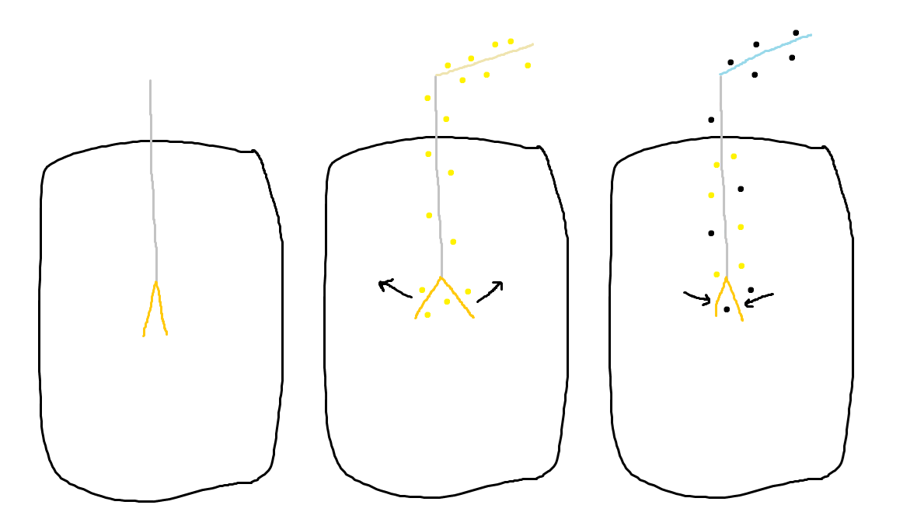

# Magnets and Sparks
We begin our journey in the Medieval Age, where the compass was developed, and sparks were observed when stockings were removed. These mysteries were later elaborated on by William Gilbert of the 17th century, who discovered that many substances other than amber could exhibit electrical properties. He also observed and identified many more phenomena such as:
- Heating up an object causes it to lose its electrostatic properties.
- Wetting an object prevents it from being electrified.
- Electrified substances attract small objects indiscriminately, while magnets only attract iron.

# The electric machine
His work was followed up by Robert Boyle, who discovered that the attractive force exhibited by electrified substances and magnets worked in a vacuum, so the air was not the medium. The first electric machine was developed by Otto von Guericke, which consisted of a rotating sulfur globe, that could be electrified by rubbing it by hand. The electric machine was later improved by Francis Hauksbee, Georg Matthias Bose, and Jan Ingenhousz.

Experiments were largely aided by the inclusion of primitive capacitors, made of plate glass coated by thin layers tin foil on both sides. Stephen Gray conducted a series of experiments, that demonstrated the difference between "electrics" and "non-electrics". He showed for example, that metal wire and packthread conducted electricity, whereas silk thread did not. In one of his experiments, he sent electricity through 800 feet of hempen thread hung up by silk, but upon replacing silk with brass wire, the current seemed to vanish somewhere. Thus he classified substances such as glass, resin, and silk into "electrics" (insulators), and metal and water into "non-electrics" (conductors). The apparent discrepancy coming from conductors allowing the current to dissipate.

# Two fluids
Intrigued by the results, Charles François de Cisternay du Fay, ran a series of experiments, which led him to conclude that metals, animals, and liquids could only be electrified by the electric machine, while the rest could only be electrified by rubbing. In another experiment involving an electroscope he discovered there were two kinds of electricity.

The setup consisted of two thin pieces of gold foil, that were first charged by glass rubbed with silk which made them repel, and then by resin rubbed with wool, which made them lose their charge. He concluded that electricity was made up of two kinds of "fluids" that cancelled each other out, were attracted to each other, and repelled themselves:
- vitreous fluid (the glass one)
- resinous fluid (the resin one)

# One fluid?
The leyden jar was invented independently by Ewald Georg von Kleist and Pieter van Musschenbroek at Leiden University. It consisted of a glass container filled with an electrolyte, coated both inside and outside in thin metal, with a metal nail protruding from an insulated cork and reaching into the fluid. This construction gave it great capacitance and so it could be used to reliably produce a powerful static discharge. Using the jar, William Watson showed discharge of static electricity exhibited the same properties as electrical current by sending it through a loop. It inspired a new theory posited independently by him and Benjamin Franklin, where the flow of current was a return to equilibrium and electricity itself was not two, but rather a deficiency or surplus of a single fluid which he called "electrical aether", and the total deficit and surplus were always equal. He also conducted experiments trying to ascertain the speed of electricity, which while failed, were able to showcase the potential use of electricity to transmit signals through great distances. He later suggested electricity to not be a fluid, but rather something more like light or magnetism, since it passes through glass and cloth, and can be concentrated as a spark to light things on fire.

# TL;DR
Stuff we know:
- Rubbing stuff makes sparks.
- Rubbing stuff continuously makes current.
- Magnets are a thing.
- Sparks and current are the same phenomenon.

Stuff we suspect:
- Electricity is two kinds of fluids. Fluids of the same kind repel each other, and fluids of opposite kind attract and cancel out each other.
- Electricity is one kind of fluid that may be in surplus or deficit. It wants to be in an equilibrium.
- Total amount of charge is constant.
- There may be some ties between light, electricity, and magnetism.

Stuff we have:
- electric machine
- capacitors
- cables